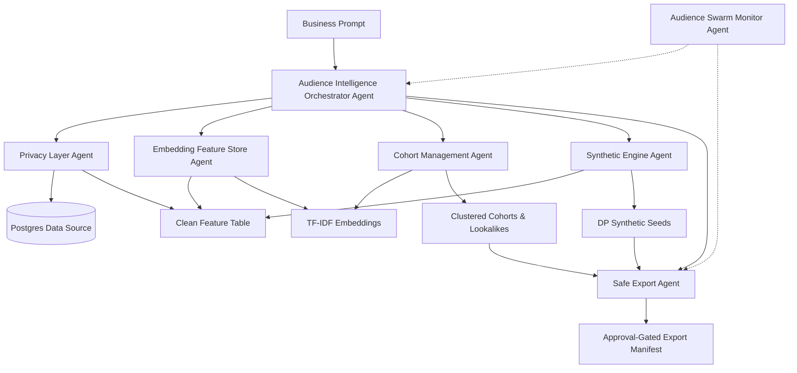

# Audience Intelligence Engine

This project is a privacy-safe Audience Intelligence microservice for Punk AI. It converts business prompts into safe audience cohorts, lookalikes, and approval-gated export packages using real Postgres-derived signals, aggregation, synthetic-safe seed generation, embeddings, clustering, cohort ranking, and safe export workflows.

## Pre-production Status

This package is prepared for pre-production technical review and validation.

**Verified capabilities:**
- Real Postgres-derived audience data flow operates securely.
- End-to-end prompt processing API works.
- Async job architecture for long-running clustering tasks is stable.
- Full suite of Agent modules functioning correctly (Ingest, Generate, Embed, Cluster, Export).
- API Key authentication enforced.
- Export workflows are correctly approval-gated.
- Strict privacy constraints (k-anonymity, differential privacy) enforce fail-closed behavior.

## Architecture

The system utilizes an agent-based architecture to process data securely:



For detailed agent responsibilities, see [Audience Intelligence Architecture](docs/audience_intelligence_architecture.md).

## Module Descriptions

1. **PrivacyLayerAgent:** Loads safe data, applies aggregation and k-anonymity, blocks unsafe columns.
2. **SyntheticEngineAgent:** Generates safe synthetic seed profiles using differential privacy.
3. **EmbeddingFeatureStoreAgent:** Generates embeddings and supports safe similarity search.
4. **CohortManagementAgent:** Performs clustering, scores cohort quality, and generates lookalikes.
5. **SafeExportAgent:** Creates approval-gated export packages and blocks downstream delivery until approval.
6. **AudienceIntelligenceOrchestratorAgent:** Orchestrates the end-to-end flow, manages intent, and produces warnings and summaries.
7. **AudienceSwarmMonitorAgent:** Tracks system health, approvals, and writes monitoring reports.

## Setup and Commands

### Environment Variables
Copy `.env.example` to `.env` and set the required variables. For testing, default safe values are provided.

### Setup and Backend Run Command
```bash
cd ~/Downloads/punk-audience-engine
source .venv/bin/activate

PYTHONPATH=. PRODUCTION_MODE=true REQUIRE_AUDIENCE_API_KEY=true SYNTHETIC_ENGINE=dp_aggregate ALLOW_SYNTHETIC_FALLBACK=false K_ANONYMITY_MIN=1000 \
uvicorn app.main:app --reload --host 0.0.0.0 --port 8000
```

### Prompt UI Usage
Access the local Prompt UI at: `http://localhost:8000/api/audience-intelligence/prompt/ui`

### API Examples

**Health Check:**
```bash
export AUDIENCE_API_KEY=$(python3 - <<'PY'
from pathlib import Path
for raw in Path(".env").read_text(errors="ignore").splitlines():
    line = raw.strip()
    if line.startswith("AUDIENCE_API_KEY="):
        print(line.split("=", 1)[1].strip().strip('"').strip("'"))
        break
PY
)

curl -sS http://localhost:8000/api/audience-intelligence/swarm/health \
  -H "X-Audience-API-Key: $AUDIENCE_API_KEY" | jq '.status, .health_status'
```

**Prompt Run Benchmark:**
```bash
time curl -sS -X POST http://localhost:8000/api/audience-intelligence/prompt/run \
  -H "Content-Type: application/json" \
  -H "X-Audience-API-Key: $AUDIENCE_API_KEY" \
  -d '{
    "prompt": "Build me a high-quality restaurant and cafe evening audience for Montreal and San Francisco",
    "source": "postgres",
    "approval_required": true,
    "postgres_limit": 10000,
    "k_min": 1000,
    "epsilon": 1.0,
    "synthetic_rows": 1000,
    "max_export_cohorts": 25,
    "min_export_quality": 0.25
  }' > /tmp/audience_latency_test.json

cat /tmp/audience_latency_test.json | jq '{
  status,
  run_id,
  prompt_selected_cohorts,
  exported_cohorts: .safe_export.exported_cohorts,
  approval_status: .safe_export.approval_status
}'
```

### Validation Commands

**Run Tests:**
```bash
PYTHONPATH=. pytest -q \
  tests/test_synthetic_engine_agent.py \
  tests/test_synthetic_engine_agent_production_paths.py \
  tests/test_privacy_layer_agent.py \
  tests/test_embedding_feature_store_agent.py \
  tests/test_cohort_management_agent.py \
  tests/test_safe_export_agent.py \
  tests/test_audience_intelligence_orchestrator_agent.py \
  tests/test_audience_job_store.py \
  tests/test_audience_swarm_monitor_agent.py \
  tests/test_audience_api_key_auth.py
```

**Run Smoke Test:**
```bash
./scripts/smoke_test_audience_intelligence_api.sh
```

## Privacy and Safety Guarantees
- No raw identifiers, MAIDs, emails, or exact lat/lngs are exported.
- Strict k-anonymity limits are enforced.
- Production environment does not allow unsafe synthetic fallback.
- Export manifests require explicit API approval.

For more details, see the [Privacy and Safety Policy](docs/privacy_safety_policy.md) and [Integration Contract](docs/audience_intelligence_integration_contract.md).

## Known Limitations and Roadmap
- **Embeddings Migration:** Currently using local TF-IDF embeddings; transition to `pgvector` planned for scalable production.
- **Privacy Budgeting:** Global epsilon tracking across queries is in development.

## Documentation
- [Architecture](docs/audience_intelligence_architecture.md)
- [Integration Contract](docs/audience_intelligence_integration_contract.md)
- [Runbook](docs/audience_intelligence_runbook.md)
- [Privacy Policy](docs/privacy_safety_policy.md)
- [Review Checklist](docs/preproduction_review_notes.md)
