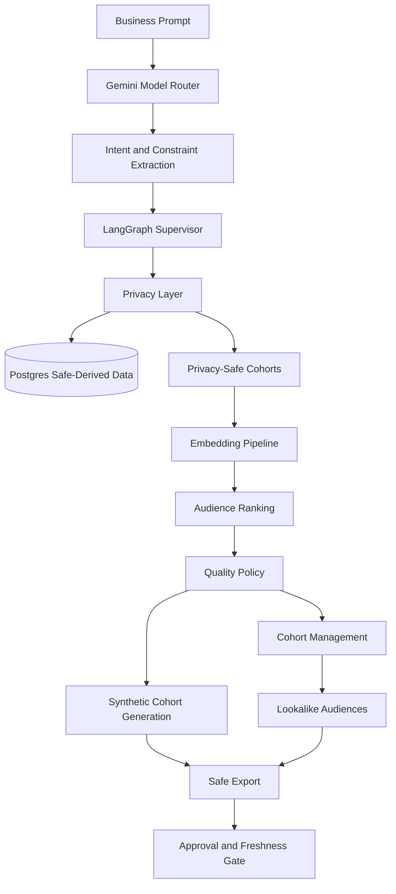

# Audience Intelligence Engine

A privacy-first audience intelligence service for Punk AI.

The platform converts natural-language campaign requests into privacy-safe audience cohorts, ranked lookalikes, synthetic cohort-level seeds, and approval-gated export packages using direct Gemini intent understanding, LangGraph orchestration, Postgres-derived signals, embeddings, clustering, and strict export controls.

---

## Overview

Audience Intelligence Engine helps campaign teams move from a business request such as:

> Build a high-quality evening restaurant audience in Montreal.

to a structured, privacy-safe audience plan that preserves the user’s requested:

- location
- business category
- daypart
- quality requirement
- approval requirement
- privacy constraints

The engine does not expose individual user records. It works with aggregated cohort-level data and blocks export whenever privacy, data freshness, or approval conditions are not satisfied.

---

## Key Capabilities

- Natural-language campaign understanding with direct Google Gemini
- Deterministic fallback when the primary model is unavailable
- LangGraph-based multi-step orchestration
- Postgres-derived audience signal ingestion
- Privacy-safe cohort generation
- K-anonymity and differential privacy controls
- Embedding-based audience ranking
- Cohort clustering and quality scoring
- Lookalike audience generation
- Synthetic cohort-level seed generation
- Approval-gated export manifests
- Source freshness validation
- Fail-closed privacy and export behavior
- Docker-based production deployment
- API-key protected endpoints

---

## How It Works

```text
Business prompt
    ↓
Gemini intent understanding
    ↓
Constraint extraction
    ↓
LangGraph orchestration
    ↓
Privacy-safe Postgres source
    ↓
Cohort generation
    ↓
Embedding and ranking
    ↓
Quality filtering
    ↓
Synthetic cohort generation
    ↓
Lookalike generation
    ↓
Approval-gated export
```

---

## Architecture



---

## Core Components

### Privacy Layer

- Loads privacy-safe source data
- Applies aggregation and k-anonymity
- Blocks unsafe columns
- Prevents individual-level data from entering the export flow
- Produces cohort-level records only

### Synthetic Data Generation

- Produces privacy-safe synthetic cohort variants
- Uses differential-privacy-aware generation
- Enforces production privacy thresholds
- Fails closed when input cohorts are unsafe

### Embedding Pipeline

- Converts cohort traits into vector representations
- Supports semantic ranking and similarity search
- Uses a configurable embedding backend
- Uses Postgres-backed vector storage in the validated Docker configuration

### Cohort Management

- Clusters related audience cohorts
- Scores audience quality
- Generates lookalike relationships
- Produces export-ready candidates

### Safe Export

- Creates approval-gated export manifests
- Blocks downstream delivery when approval is missing
- Blocks stale-source exports
- Prevents raw identifiers and personal data from being exported

### Orchestration

- Coordinates the end-to-end workflow
- Preserves requested business constraints
- Verifies intermediate decisions
- Repairs incomplete plans
- Prevents downstream stages from overriding terminal safety decisions

---

## Privacy by Design

The export workflow is designed to keep the following values false:

```text
Raw MAIDs exported: False
Hashed identifiers exported: False
Raw observations exported: False
Raw latitude/longitude exported: False
Email exported: False
Phone exported: False
Individual user data exported: False
```

Production synthetic generation enforces:

```text
k_min = 1000
```

The system blocks export when:

- the request asks for raw personal identifiers
- the requested audience has no safe match
- source data is stale
- required approval is missing
- privacy thresholds are not satisfied
- required constraints are incomplete

---

## Technology Stack

- Python
- FastAPI
- LangGraph
- Google Gemini
- PostgreSQL
- Redis
- Pandas
- SDV
- Scikit-learn
- Docker
- Docker Compose
- Pytest

Validated Docker backends:

```text
Embedding backend: sklearn_hashing
Vector backend: postgres_array
Run history: PostgreSQL
Synthetic engine: DPAggregateCohortSynthesizer
```

---

## Getting Started

### Prerequisites

- Python 3.11 or later
- PostgreSQL
- Docker and Docker Compose
- A Gemini API key
- Project environment variables

### Install

```bash
git clone https://github.com/Vps2905/punk-audience-engine.git
cd punk-audience-engine

python3 -m venv .venv
source .venv/bin/activate

python -m pip install --upgrade pip setuptools wheel
python -m pip install -r requirements.txt
```

---

## Environment Configuration

Create the local environment file:

```bash
cp .env.example .env
```

Configure the required values:

```env
APP_ENV=development
PRODUCTION_MODE=false

ENABLE_LLM_INTENT=true
LLM_INTENT_PROVIDER=gemini
LLM_INTENT_MODEL=gemini-3.5-flash-lite
LLM_INTENT_MODEL_CHAIN=

GEMINI_API_KEY=<YOUR_GEMINI_API_KEY>
GEMINI_BASE_URL=https://generativelanguage.googleapis.com/v1beta/openai/chat/completions
```

Do not commit `.env` or any real credentials.

Confirm the file is ignored:

```bash
git check-ignore -v .env
```

---

## Run Locally

```bash
source .venv/bin/activate

AUDIENCE_LOCAL_UI_ENABLED=true \
PRODUCTION_MODE=false \
APP_ENV=local \
PYTHONPATH=. python -m uvicorn app.main:app \
  --host 127.0.0.1 \
  --port 8000 \
  --reload
```

Health endpoint:

```bash
curl -fsS http://127.0.0.1:8000/health
```

Prompt UI:

```text
http://127.0.0.1:8000/audience-workspace
```

The workspace is intentionally available only on loopback in a
non-production environment. It sends only the prompt from the browser;
database configuration, tenant identity, privacy thresholds, and approval
controls remain server-side.

---

## Run with Docker

### Build

```bash
docker compose build audience-engine
```

### Start

```bash
docker compose up -d audience-engine
```

### Rebuild after code changes

```bash
docker compose build audience-engine

docker compose up -d \
  --force-recreate \
  audience-engine
```

### Check health

```bash
docker ps --filter name=punk-audience-engine

curl -fsS http://127.0.0.1:8000/health
```

Expected response:

```json
{
  "status": "ok",
  "service": "Audience Intelligence Engine"
}
```

### View logs

```bash
docker logs --tail 200 punk-audience-engine
```

---

## API Authentication

Production endpoints require an audience API key.

```bash
export AUDIENCE_API_KEY="<YOUR_AUDIENCE_API_KEY>"
```

Example header:

```text
X-Audience-API-Key: <YOUR_AUDIENCE_API_KEY>
```

---

## API Examples

### Swarm Health

```bash
curl -sS \
  http://localhost:8000/api/audience-intelligence/swarm/health \
  -H "X-Audience-API-Key: $AUDIENCE_API_KEY"
```

### Run an Audience Request

```bash
curl -sS -X POST \
  http://localhost:8000/api/audience-intelligence/prompt/run \
  -H "Content-Type: application/json" \
  -H "X-Audience-API-Key: $AUDIENCE_API_KEY" \
  -d '{
    "prompt": "Build a high-quality evening restaurant audience in Montreal",
    "source": "postgres",
    "approval_required": true,
    "postgres_limit": 10000,
    "k_min": 1000,
    "epsilon": 1.0,
    "synthetic_rows": 1000,
    "max_export_cohorts": 25,
    "min_export_quality": 0.25
  }'
```

---

## Example Campaign Request

```text
We are launching a premium dinner campaign for our restaurant in Montreal.
Build a high-quality, privacy-safe audience of people who visit restaurants
during the evening. Preserve the Montreal location, restaurant category,
evening timing, and quality requirement. Prepare only approval-gated export
candidates without exposing individual user data.
```

Expected interpretation:

```text
Location: Montreal
Category: restaurant
Daypart: evening
Quality: high
Approval required: true
Privacy-safe output only: true
```

Expected safety behavior:

```text
Approval status: blocked until all gates pass
Downstream export enabled: False
```

---

## Testing

Run the complete test suite:

```bash
source .venv/bin/activate
PYTHONPATH=. pytest -q
```

Latest validated result:

```text
450 passed, 3 skipped
```

Run Gemini and semantic intent tests:

```bash
PYTHONPATH=. pytest -q \
  tests/test_llm_model_router_response_handling.py \
  tests/test_dynamic_natural_language_acceptance.py \
  tests/test_semantic_intent_live_flow_regressions.py
```

Check formatting:

```bash
git diff --check
```

---

## Direct Gemini Verification

```bash
source .venv/bin/activate

PYTHONPATH=. python - <<'PY'
from app.agents.audience_intelligence_orchestrator_agent import (
    AudienceIntelligenceOrchestratorAgent,
)

result = AudienceIntelligenceOrchestratorAgent().run(
    prompt=(
        "Build a high-quality evening restaurant audience "
        "in Montreal for a premium dinner campaign."
    )
)

intent = (
    (result.get("v2_autonomous") or {})
    .get("prompt_intent")
    or {}
)

print("llm_used:", intent.get("llm_used"))
print("llm_provider:", intent.get("llm_provider"))
print("llm_model:", intent.get("llm_model"))
print("llm_fallback_used:", intent.get("llm_fallback_used"))
print("llm_error:", intent.get("llm_error"))
print("resolver_mode:", intent.get("resolver_mode"))
PY
```

Expected:

```text
llm_used: True
llm_provider: gemini
llm_model: gemini-3.5-flash-lite
llm_fallback_used: False
llm_error: None
resolver_mode: llm_rag_primary
```

---

## Current Project Status

The core Audience Intelligence workflow is operational and validated for controlled pre-production use.

Verified:

- direct Gemini integration
- LangGraph orchestration
- privacy-safe Postgres ingestion
- audience ranking
- synthetic cohort generation
- lookalike generation
- Docker deployment
- API health
- approval-gated export
- automated test coverage

Remaining production work:

- refresh and continuously validate production source data
- complete external ad-platform delivery integration
- validate retry and idempotency behavior
- validate multi-worker scaling and database-pool behavior
- add production monitoring, tracing, and alerting
- complete persistent checkpoint recovery testing
- benchmark production retrieval quality

---

## Documentation

- [Architecture](docs/audience_intelligence_architecture.md)
- [Integration Contract](docs/audience_intelligence_integration_contract.md)
- [Runbook](docs/audience_intelligence_runbook.md)
- [Privacy and Safety Policy](docs/privacy_safety_policy.md)
- [Pre-production Review Notes](docs/preproduction_review_notes.md)

---

## Security

Do not report security vulnerabilities in public issues.

Share security findings privately with the project maintainers and include:

- affected component
- reproduction steps
- observed impact
- recommended mitigation
