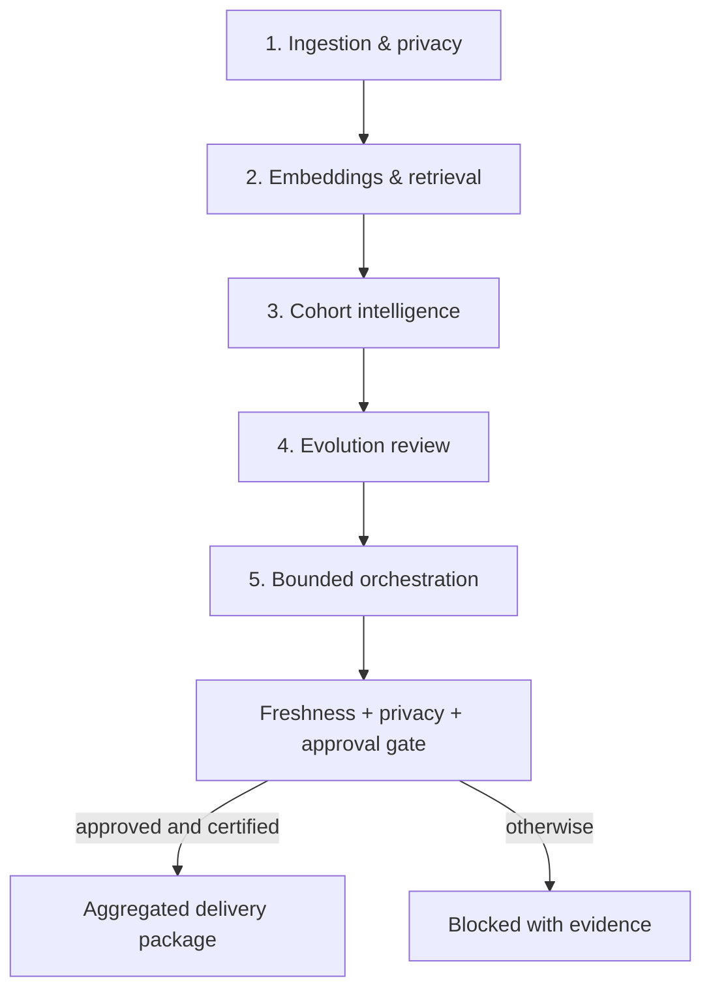

# Punk Audience Intelligence Engine

[](https://github.com/Vps2905/punk-audience-engine/actions/workflows/ci.yml)

A privacy-first audience intelligence and bounded-agent orchestration service for
turning campaign goals into reviewable, aggregated audience recommendations.

> **Current maturity:** engineering-complete for historical/local shadow
> evaluation and ready for controlled staging review. Live provider ingestion,
> activation connectors, and production cutover are disabled by default and are
> not yet certified.

## What the engine does

The engine accepts a business request such as:

> Build a high-quality evening restaurant audience for Montreal using the latest
> available privacy-safe data.

It then coordinates privacy controls, semantic retrieval, cohort intelligence,
evolution review, and governance to produce an evidence-backed recommendation.
Unsafe identifier requests and attempts to bypass approval are rejected before
source access or audience processing.

The system is designed to:

- ingest governed CSV, API, S3, and PostgreSQL-derived signals;
- hash or remove identifiers at the privacy boundary;
- enforce aggregation, k-anonymity, differential privacy, and lineage;
- build and retrieve pinned semantic features in PostgreSQL/pgvector;
- create, score, deduplicate, and review cohorts and lookalikes;
- compare governed evolution proposals without autonomous live mutation;
- coordinate the five modules through a bounded, authorization-aware agent layer;
- keep activation and delivery behind freshness, privacy, authorization, and
  manual-approval gates.

## Safety invariants

These are product boundaries, not optional prompt instructions:

- raw MAIDs, device IDs, email addresses, phone numbers, observations, and exact
  latitude/longitude are not returned by audience workflows;
- hashed individual identifiers are not treated as safe aggregate output;
- tenant identity is authenticated and propagated across API, job, and history
  boundaries;
- terminal privacy and approval-bypass decisions stop downstream execution;
- stale data, insufficient cohort size, missing approval, or failed authorization
  blocks activation;
- production-effect flags default to disabled;
- historical and synthetic evaluation never implies live-delivery certification.

The default production k-anonymity threshold is `k_min = 1000`. Privacy and
delivery rules are documented in the
[privacy safety policy](docs/privacy_safety_policy.md).

## Five-module architecture



| Module | Responsibility | Implemented controls |
| --- | --- | --- |
| 1. Ingestion & privacy | Govern provider deliveries and derive privacy-safe features | hashing/removal, aggregation, k-anonymity, DP accounting, lineage, idempotency, retry, quarantine, DLQ, reconciliation |
| 2. Embeddings & retrieval | Build searchable behavioral/contextual representations | immutable model artifacts, model registry, 384-dimensional vectors, pgvector, hybrid retrieval, multilingual benchmark gates |
| 3. Cohort intelligence | Create and assess aggregated audiences | rule and vector candidates, clustering, quality scoring, overlap/deduplication, governed lookalikes, lifecycle and shadow review |
| 4. Evolution control | Measure changes without uncontrolled mutation | immutable snapshots, drift evidence, recommendations, approval shadow, recovery and rollback controls |
| 5. Agent orchestration | Plan and coordinate work across the other modules | goal decomposition, capability authorization, bounded execution, terminal safety, dual-run comparison, repeated shadow evidence, scale/latency/recovery gates |

Cross-cutting services add tenant isolation, aggregate quality monitoring,
observability/SLO governance, security hardening, preproduction certification,
AWS Infrastructure as Code, and CI supply-chain checks.

## Bounded autonomy model

Module 5 is an agentic control plane, but it is intentionally not an unrestricted
autonomous actor. It can interpret goals, select authorized capabilities, execute
read-only or shadow functions, compare results, recover from bounded failures,
and produce certification evidence. It cannot grant itself privileges, override
terminal safety decisions, enable production effects, or approve delivery.

The governed state transition is:

```text
goal -> plan -> authorize -> execute/shadow -> compare -> review -> approve or block
```

See the [bounded autonomy design](docs/module5_6_bounded_autonomous_orchestration.md)
and [operator evidence chain](docs/module5_operator_evidence_chain.md).

## Current readiness

| Area | Status |
| --- | --- |
| Application implementation | Five modules and cross-cutting control planes implemented |
| Automated verification | `1206 passed, 3 skipped` at commit `76191cec12c2e0a5a92c2a20720415e9dfb6e1df` |
| Historical evaluation | Supported with privacy-safe, read-only/shadow evidence |
| Terminal safety | Identifier extraction and approval-bypass attempts fail before source access |
| Module 5 evidence | Repeated shadow, functional shadow, authorization, and scale/recovery harnesses implemented |
| CI and supply chain | Tests, dependency/source/IaC checks, container smoke, critical vulnerability gate, SBOM, and signing workflow |
| Infrastructure | Deployment-oriented AWS CloudFormation and preproduction runbooks implemented |
| Real staging deployment | Requires deployment and verification in an actual staging account |
| Fresh provider certification | Pending representative fresh vendor deliveries and operational reconciliation evidence |
| Activation connector certification | Pending approved aggregate/synthetic sandbox certification |
| Live production | Not authorized; production routing and delivery remain disabled |

Passing tests demonstrate implementation quality; they do not replace staging,
security/privacy review, fresh-data validation, load/soak testing, disaster
recovery exercises, or connector certification.

## Technology

- Python 3.11 and FastAPI
- LangGraph-based orchestration
- PostgreSQL and pgvector
- sentence-transformers with pinned model revisions and offline artifacts
- SDV and privacy-safe aggregate synthesis
- pandas and scikit-learn
- Docker and Docker Compose
- AWS CloudFormation
- pytest, Bandit, pip-audit, cfn-lint, Trivy, Syft, and Cosign

The language-model router is optional. Authoritative privacy, authorization,
freshness, and approval decisions remain deterministic service controls.

## Quick start for local evaluation

### Prerequisites

- Git
- Python `3.11.x`
- [`uv`](https://docs.astral.sh/uv/) `0.11.33`
- PostgreSQL for database-backed flows
- Docker with Compose for container and pgvector workflows

### Install

```bash
git clone --branch audience-intelligence-agents --single-branch \
  https://github.com/Vps2905/punk-audience-engine.git
cd punk-audience-engine

uv sync --frozen --python 3.11
cp .env.example .env
```

Configure `.env` with locally generated secrets and the databases required for
the flow you intend to test. Never commit `.env`, credentials, provider data, or
runtime evidence. The application validates environment safety and fails closed
when production requirements are incomplete.

### Prefetch the pinned semantic model

```bash
MODEL_CACHE="$HOME/.cache/punk-audience-semantic-model"

HF_HUB_OFFLINE=0 \
TRANSFORMERS_OFFLINE=0 \
LOCAL_SEMANTIC_MODEL_CACHE="$MODEL_CACHE" \
PYTHONPATH=. \
uv run --frozen python scripts/prefetch_local_semantic_model.py \
  --cache-dir "$MODEL_CACHE"
```

The prefetch command verifies the configured model revision and materializes an
offline artifact. CI and container builds use the same pinned-artifact policy.

### Start the local workspace

```bash
MODEL_CACHE="$HOME/.cache/punk-audience-semantic-model"

AUDIENCE_LOCAL_UI_ENABLED=true \
AUDIENCE_LOCAL_UI_TENANT_ID=punk_internal \
PRODUCTION_MODE=false \
APP_ENV=local \
REQUIRE_AUDIENCE_API_KEY=true \
SYNTHETIC_ENGINE=dp_aggregate \
ALLOW_SYNTHETIC_FALLBACK=false \
K_ANONYMITY_MIN=1000 \
HF_HUB_OFFLINE=1 \
TRANSFORMERS_OFFLINE=1 \
LOCAL_SEMANTIC_MODEL_CACHE="$MODEL_CACHE" \
PYTHONPATH=. \
uv run --frozen uvicorn app.main:app \
  --host 127.0.0.1 \
  --port 8000
```

Open <http://127.0.0.1:8000/audience-workspace>. The local workspace keeps
credentials on the server and uses an HttpOnly loopback session. It is disabled
in production mode.

Health endpoints:

```bash
curl --fail http://127.0.0.1:8000/health
curl --fail http://127.0.0.1:8000/ready
```

## API example

Authenticated service endpoints accept either `X-Audience-API-Key` or a bearer
token as defined by the
[integration contract](docs/audience_intelligence_integration_contract.md).

```bash
curl --fail-with-body \
  -H "X-Audience-API-Key: $AUDIENCE_API_KEY" \
  -H "Content-Type: application/json" \
  -X POST \
  http://127.0.0.1:8000/api/audience-intelligence/prompt/run \
  --data '{
    "prompt": "Build a high-quality evening restaurant audience for Montreal using privacy-safe data. Keep activation blocked pending review.",
    "source": "postgres",
    "approval_required": true,
    "postgres_limit": 10000,
    "k_min": 1000,
    "epsilon": 1.0,
    "synthetic_rows": 1000,
    "max_export_cohorts": 25,
    "min_export_quality": 0.25
  }'
```

The response includes run status, source/freshness evidence, selected cohorts,
privacy guarantees, approval status, and whether downstream export is enabled.

## Testing

Compile and run the complete locked test suite:

```bash
python -m compileall -q app scripts tests

REQUIRE_AUDIENCE_API_KEY=true \
HF_HUB_OFFLINE=1 \
TRANSFORMERS_OFFLINE=1 \
LOCAL_SEMANTIC_MODEL_CACHE="$HOME/.cache/punk-audience-semantic-model" \
PYTHONPATH=. \
uv run --frozen python -m pytest -q
```

Validate migration ordering separately when adding a migration:

```bash
PYTHONPATH=. uv run --frozen python -m pytest -q \
  tests/test_migration_version_uniqueness.py
```

The GitHub workflow also exercises PostgreSQL integration, dependency and source
security gates, CloudFormation linting, an immutable container smoke test,
critical vulnerability scanning, SBOM generation, and keyless signing.

## Docker and deployment

The root `Dockerfile` is an immutable, non-root runtime image with a pinned
semantic model artifact. `docker-compose.yml` is deployment-oriented: it expects
real production secrets, TLS database connectivity, and explicit configuration.
It is not a substitute for a staging account.

Before any live rollout, complete the
[preproduction deployment certification runbook](docs/preproduction_deployment_certification_runbook.md)
and verify fresh-provider delivery, migrations, IAM, secrets, networking,
observability, backup/restore, failover, and activation connectors in their real
target environments.

## Repository layout

```text
app/             FastAPI routes, contracts, agents, and production services
docs/            Architecture, change manifests, policies, and operator runbooks
infrastructure/  AWS CloudFormation and deployment assets
migrations/      Ordered PostgreSQL migrations (0001-0033)
samples/         Safe examples and reviewed contract samples
scripts/         Migration, benchmark, evidence, and certification CLIs
tests/           Unit, integration, security, migration, and production gates
.github/         CI and dependency update automation
```

Runtime data and operator evidence belong outside version control.

## Documentation map

Start with:

- [Architecture](docs/audience_intelligence_architecture.md)
- [Integration contract](docs/audience_intelligence_integration_contract.md)
- [Operations runbook](docs/audience_intelligence_runbook.md)
- [Privacy safety policy](docs/privacy_safety_policy.md)
- [Authenticated tenant boundary](docs/authenticated_tenant_api_boundary_runbook.md)

Module and production readiness references:

- [Module 1 provider control plane](docs/module1_provider_control_plane_runbook.md)
- [Module 2 completion runbook](docs/module2_full_completion_runbook.md)
- [Module 3 cohort candidates](docs/module3_1_2_governed_cohort_candidates.md)
- [Module 4 evolution snapshots](docs/module4_1_governed_evolution_snapshots.md)
- [Module 5 governed coordination](docs/module5_governed_agent_coordination.md)
- [Module 5 functional shadow](docs/module5_9_functional_shadow_execution.md)
- [Module 5 security authorization](docs/module5_10_agent_security_authorization.md)
- [Module 5 scale and recovery](docs/module5_11_scale_latency_recovery_certification.md)
- [CI and supply-chain runbook](docs/production_ci_supply_chain_runbook.md)
- [Security hardening](docs/production_security_hardening.md)
- [Observability and SLO governance](docs/production_observability_slo_governance.md)
- [Infrastructure as Code](docs/production_infrastructure_as_code_runbook.md)

## Contributing and security

See [CONTRIBUTING.md](CONTRIBUTING.md) before proposing a change. Security and
privacy findings should follow [SECURITY.md](SECURITY.md) and must not be posted
with real credentials, identifiers, or provider records.

## License

No public license has been declared for this repository. Unless and until the
repository owner adds one, the source remains under the owner's default
copyright rights.
