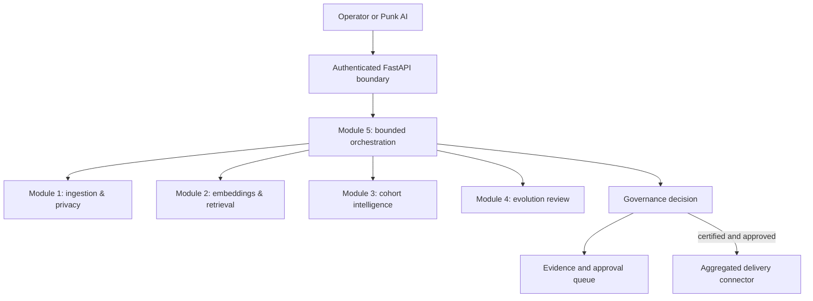
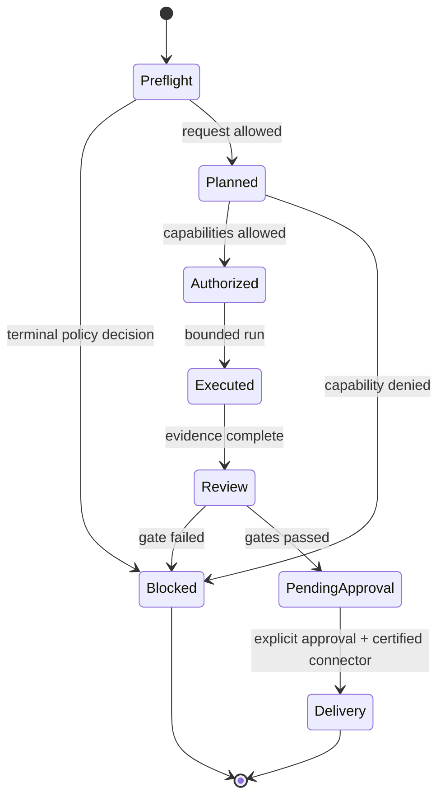

# Audience Intelligence Architecture

This document describes the governed preproduction architecture of the Punk
Audience Intelligence Engine. The system supports historical and synthetic
evaluation today. Live provider routing and downstream activation remain disabled
until their real environments are certified.

## System context

The orchestrator coordinates module capabilities; it does not replace the
authoritative privacy, authorization, freshness, or approval services.

## Module responsibilities

### Module 1: ingestion and privacy

Module 1 accepts governed provider deliveries and derives safe aggregate
features. Its control plane covers:

- CSV, API, S3, and PostgreSQL-derived delivery contracts;
- immediate identifier hashing/removal and unsafe-column rejection;
- aggregation and k-anonymity (production default `k_min = 1000`);
- differential-privacy accounting and deterministic seed governance;
- delivery idempotency, lineage, retries, quarantine, DLQ, and reconciliation;
- freshness, rights, schema, and activation-eligibility evidence.

Raw records are not passed to retrieval, cohort, or export APIs.

### Module 2: embeddings and retrieval

Module 2 converts approved aggregate features into searchable representations:

- immutable local semantic-model artifacts and revision pinning;
- a tenant-scoped embedding-model registry with benchmark/approval state;
- 384-dimensional feature vectors in PostgreSQL/pgvector;
- semantic, lexical, metadata-filtered, and hybrid retrieval;
- multilingual benchmark authoring and human gold-label review;
- feature-set freshness and retrieval/activation eligibility.

Legacy historical snapshots can be imported for offline comparison, but they do
not become activation-eligible merely because retrieval succeeds.

### Module 3: cohort intelligence

Module 3 turns retrieved aggregate features into reviewable audience candidates:

- deterministic and vector-driven candidate formation;
- clustering, size/coherence/quality scoring, and policy thresholds;
- overlap measurement and deduplication;
- governed lookalike comparison;
- lifecycle monitoring and Punk AI shadow observations.

Persisted cohort definitions contain aggregate traits and safe representatives,
not individual user records.

### Module 4: evolution control

Module 4 evaluates how cohorts and strategies change over time:

- immutable evolution snapshots;
- drift and quality evidence;
- mutation/evolution recommendations;
- approval-shadow comparison;
- recovery, rollback, and audit history.

Automatic live mutation is disabled by default. Recommendations are evidence for
review, not permission to change or deliver an audience.

### Module 5: conversational bounded orchestration

Module 5 converts an operator goal into a governed execution plan and coordinates
the first four modules. It includes:

- natural-language goal and constraint understanding;
- plan construction and capability selection;
- tenant- and actor-bound authorization;
- functional shadow execution using real service boundaries;
- legacy/new dual-run comparison;
- repeated-shadow certification;
- security-authorization evidence;
- scale, latency, and recovery certification harnesses.

The agent cannot self-authorize, enable production effects, bypass a terminal
decision, or approve delivery.

## Request lifecycle

Terminal identifier-extraction and approval-bypass requests stop at preflight.
Source access, semantic retrieval, cohort processing, and delivery are recorded as
not evaluated/skipped.

## Data planes and storage

| Plane | Purpose | Safety boundary |
| --- | --- | --- |
| Historical/provider source | Read provider events and deliveries | separate source credentials; no direct activation |
| Feature database | Store tenant-scoped aggregate feature sets and pgvector representations | forced RLS, reader/writer role separation, model registry |
| Proposal/evidence database | Store plans, decisions, snapshots, approvals, and recovery evidence | authenticated tenant context and append-oriented audit records |
| Runtime artifacts | Temporary local/shadow outputs and CI evidence | excluded from Git; no credentials or raw identifiers |
| Delivery connector | Create an approved aggregate/synthetic package | disabled until freshness, authorization, approval, and connector certification pass |

## Cross-cutting control planes

- **Authentication and tenant isolation:** API-key/bearer authentication, signed
  tenant context, RLS, job/history tenant boundaries, and role separation.
- **Terminal safety:** deterministic rejection of prohibited identifiers and
  attempts to bypass privacy, freshness, safety, or manual approval.
- **Quality:** aggregate data-quality signals and fail-closed readiness decisions.
- **Observability:** SLO evidence, structured health/status contracts, and audit
  correlation without raw-data leakage.
- **Security:** environment validation, HTTP hardening, secret-safe status
  surfaces, least privilege, and release gates.
- **Supply chain:** locked dependencies, pinned GitHub Actions and model artifacts,
  source/dependency/IaC scanning, container scanning, SBOM, and signing evidence.
- **Infrastructure:** CloudFormation for deployment-oriented runtime, networking,
  IAM, storage, and observability resources.

## Deployment modes

| Mode | Intended use | Production effects |
| --- | --- | --- |
| Local safe evaluation | Developer tests and UI inspection with safe data | disabled |
| Historical shadow | Read-only comparison against privacy-safe historical evidence | disabled |
| Fresh-data shadow | Validate current provider delivery and end-to-end behavior | disabled |
| Internal canary | Limited staging execution after security/operations sign-off | approval-gated |
| Limited delivery | Certified connector with explicitly approved aggregate/synthetic audience | approval-gated |
| Broader production | Only after sustained SLO, recovery, privacy, and connector evidence | separately authorized |

Feature flags for Module 2-5 production routing, agent production effects,
security release, and scale/recovery cutover default to false. Changing a flag is
not itself certification.

## Certification boundary

The repository provides the implementation and evidence-generation mechanisms.
The following must still be proven in their real target environments:

1. AWS staging deployment, networking, IAM, secrets, and migrations;
2. representative fresh provider deliveries, schema changes, retries,
   quarantine, DLQ, and reconciliation;
3. activation-connector sandbox behavior using explicitly approved aggregate or
   synthetic audiences;
4. load/soak/concurrency, worker restart, database failover, backup/restore, and
   disaster recovery;
5. dependency/container/secret scanning results, penetration testing, IAM review,
   retention/deletion verification, and privacy/legal sign-off;
6. controlled rollout from historical shadow to fresh shadow, canary, and limited
   approval-gated delivery.

Automated tests and historical evidence support staging review; they do not
authorize live production.
