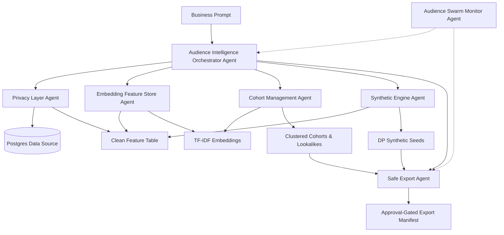

# Audience Intelligence Architecture

This document describes the pre-production architecture of the Audience Intelligence microservice for Punk AI.

## Architecture Diagram

## Agent Responsibilities

1. **PrivacyLayerAgent**
   - Loads safe Postgres-derived data or safe artifact data.
   - Applies aggregation, k-anonymity, and DP noise.
   - Removes/blocks unsafe columns.
   - Produces `clean_feature_table.csv`.

2. **SyntheticEngineAgent**
   - Uses production engine: `dp_aggregate`.
   - Generates safe synthetic seed profiles.
   - Maintains an epsilon ledger.
   - Does not allow unsafe fallback in production.

3. **EmbeddingFeatureStoreAgent**
   - Uses local sklearn TF-IDF embeddings.
   - Generates vector files and metadata.
   - Supports safe similarity search.

4. **CohortManagementAgent**
   - Performs clustering.
   - Scores cohort quality.
   - Filters export-ready cohorts.
   - Generates lookalike cohort pairs.

5. **SafeExportAgent**
   - Creates approval-gated export packages.
   - Creates safe export manifests and Meta seed payloads.
   - Blocks downstream delivery until explicit approval is granted.

6. **AudienceIntelligenceOrchestratorAgent**
   - Runs the end-to-end prompt flow.
   - Understands prompt location, category, and daypart intent.
   - Performs safe filtering and produces coverage warnings.
   - Produces the final business summary.

7. **AudienceSwarmMonitorAgent**
   - Checks system health and tracks pending approvals.
   - Tracks coverage warnings and approved exports.
   - Writes safe monitoring reports.

## Data Flow and Safety Gates

1. **Ingestion Gate:** The PrivacyLayerAgent drops all identifiers and PII immediately upon loading from Postgres.
2. **Aggregation Gate:** k-anonymity is enforced before embeddings are generated.
3. **Synthetic Gate:** The SyntheticEngineAgent uses differential privacy to generate seed profiles, ensuring no real user profiles are ever used as seeds.
4. **Export Gate:** The SafeExportAgent halts the pipeline and requires explicit API approval before generating the final export manifest.

## Pre-production vs Production Responsibilities

- **Pre-production:** Focuses on validation of the privacy pipeline, cohort quality scoring, and API contract stability. Real Meta uploads are disabled. Local embeddings (TF-IDF) are used for baseline validation.
- **Production (Roadmap):** Will integrate with pgvector for scalable embedding search, implement strict epsilon budget accounting across multiple runs, and enable authenticated Meta custom audience uploads upon explicit stakeholder approval.
